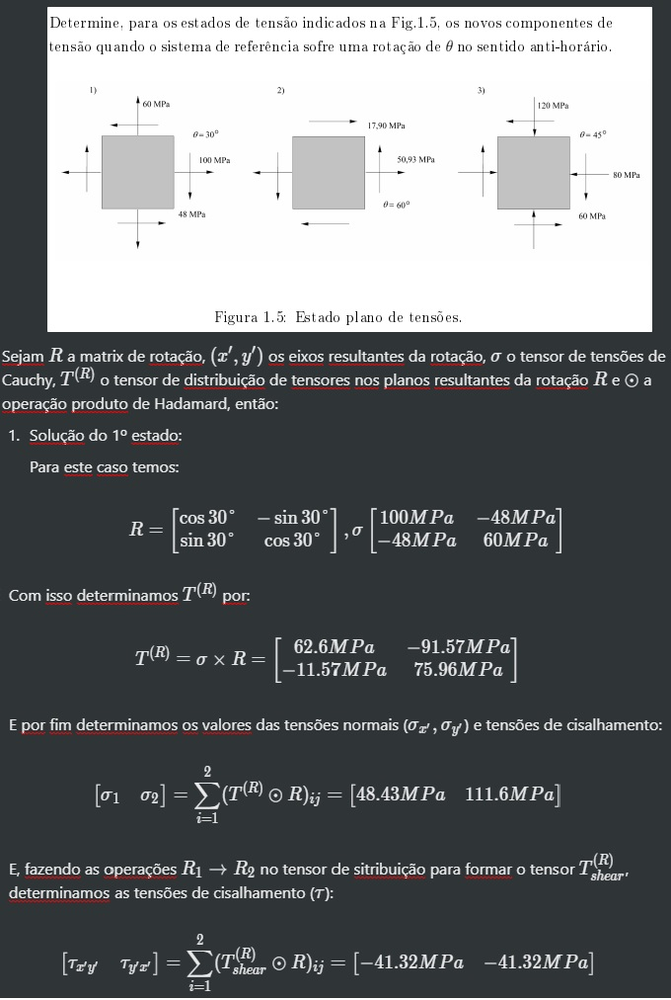
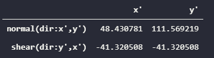

# stressmodule

### ⚠ A module with functions to help with Stress analysis 💪.

## List of functions

### 🌹 strain_rosette
Calculates the canonical axial stresses on the element based on strain gauges
measurements.

### 🦖 strain_to_stress 
Calculates the normal stresses on the element based on it's canonical strains.

### 🏆 principal_stresses
Calculates the principal stresses on the element based on it's canonical stresses.

### 🧘‍♂️ stress_state
Calculates the normal and shear stresses on any orientation based on the element canonical stresses.

### 👮‍♀️ von_mises_stress
Calculates the Von Mises stress on the element based on it's Cauchy's stress tensor.

## Examples:

### stress_state Application:
Problem and Standard Solution:


Let's solve the first problem with the stress_state function:

```python
        import stressmodule as sm
        import numpy as np 

        # Cauchy Stress Tensor:
        cauchy = np.matrix([
                            [100, -48],
                            [-48, 60]
                            ])

        # Plans Orientation:
        plan_orientation=30

        sm.stress_state(cauchy, plan_orientation)
```

Output:


Let's solve the other two:
```python
        import stressmodule as sm
        import numpy as np 

        # Cauchy Stress Tensor:
        cauchy = np.matrix([
                            [50.93, 17.90],
                            [17.90, 0]
                            ])

        # Plans Orientation:
        plan_orientation=60

        sm.stress_state(cauchy, plan_orientation,2)
```
Output:


```python
        import stressmodule as sm
        import numpy as np 

        # Cauchy Stress Tensor:
        cauchy = np.matrix([
                            [-80, -60],
                            [-60, -120]
                            ])

        # Plans Orientation:
        plan_orientation=45

        sm.stress_state(cauchy, plan_orientation,2)
```
Output:


## End
Hope you enjoy! :grin:
Please, consider hitting the star button!!!